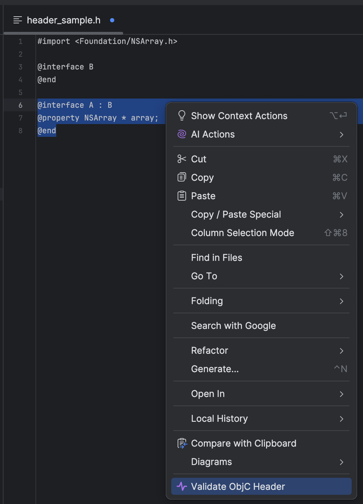

# Objective-C validation IJ plugin
Plugin for validation Objective-C code.

## Build
1. Checkout repository
2. `./gradlew buildPlugin`
3. Open IJ `Settings` > `Plugin` > `Gear icon` > `Install Plugin from Disk...`
4. Select zip archive with plugin at `build/distributions/objc-validator-1.0-SNAPSHOT.zip`

## Use
Can be used in 5 ways
1. From context menu of project by selecting a file
2. From editor context menu without any selection
3. From editor context menu when particular source code is selected
4. From `Tools` menu
5. With clipboard assigning hotkey to `Tools` menu `Validate ObjC header`

## How it works
The plugin makes sample Xcode project and adds header provided by user runs `xcodebuild`.

## Customization
If some dependencies needs to be provided you can add them to `resources/app/dependencies.h`. The header will be copied to the sample Xcode project and used with your head.